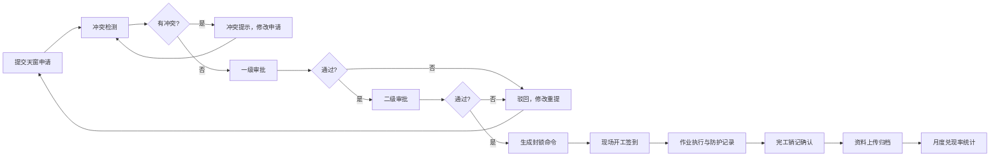

## 1. 产品概述

铁路施工天窗管理系统是面向铁路施工单位与运输组织人员的协同作业平台，实现施工天窗计划的全生命周期管理，涵盖申请、审批、执行、防护、变更和归档全流程。

- 解决铁路施工天窗计划线下流转效率低、冲突检测困难、现场执行不可控的痛点
- 目标用户：施工单位作业人员、运输调度人员、安全防护人员、各级审批管理人员

## 2. 核心功能

### 2.1 用户角色

| 角色 | 注册方式 | 核心权限 |
|------|----------|----------|
| 施工单位人员 | 系统分配 | 提交天窗申请、登记作业人员与机具、现场签到销记、申请变更 |
| 运输调度人员 | 系统分配 | 天窗时段查询、冲突检测、审批流转、封锁命令确认 |
| 安全防护人员 | 系统分配 | 防护员联络记录、安全措施落实确认 |
| 审批管理人员 | 系统分配 | 多级审批、月度兑现率统计、资料归档审核 |

### 2.2 功能模块

1. **计划日历界面**：天窗时段可视化日历、月度计划总览、冲突高亮显示
2. **申请填报界面**：施工范围选择、影响车站标注、作业人员登记、机具清单、风险措施
3. **审批流转界面**：多级审批流程、审批意见、冲突检测报告、状态跟踪
4. **现场执行界面**：封锁命令确认、现场开工签到、销记确认、执行进度
5. **安全防护界面**：防护员联络记录、防护措施落实、风险预警
6. **变更管理界面**：计划变更申请、延期说明、变更审批、影响分析
7. **资料归档界面**：资料上传、档案查询、月度兑现率统计、报表导出

### 2.3 页面详情

| 页面名称 | 模块名称 | 功能描述 |
|----------|----------|----------|
| 计划日历 | 日历视图 | 月/周/日视图切换，天窗时段色块标注，点击查看详情 |
| 计划日历 | 时段查询 | 按日期、车站、施工类型筛选查询天窗时段 |
| 计划日历 | 冲突检测 | 自动识别时间/空间冲突，红色高亮提示 |
| 申请填报 | 基本信息 | 施工项目、施工单位、负责人、联系方式填写 |
| 申请填报 | 施工范围 | 线路区间选择、里程范围标注、影响车站多选 |
| 申请填报 | 人员机具 | 作业人员名单登记、施工机具清单录入 |
| 申请填报 | 风险措施 | 危险源识别、安全防护措施、应急预案填写 |
| 审批流转 | 待办列表 | 待审批申请列表，一键跳转审批 |
| 审批流转 | 审批操作 | 同意/驳回、审批意见填写、转交下一节点 |
| 审批流转 | 流程跟踪 | 审批进度可视化、历史审批记录查询 |
| 现场执行 | 命令确认 | 封锁调度命令接收与确认 |
| 现场执行 | 签到销记 | 开工签到、作业进度更新、完工销记 |
| 安全防护 | 联络记录 | 防护员定时联络记录、异常情况上报 |
| 安全防护 | 措施检查 | 防护设施检查清单、安全确认签字 |
| 变更管理 | 变更申请 | 变更原因、变更内容、影响范围说明 |
| 变更管理 | 延期申请 | 延期时长、延期原因、现场情况说明 |
| 资料归档 | 资料上传 | 施工方案、签到记录、验收报告上传 |
| 资料归档 | 统计报表 | 月度兑现率、施工完成情况统计图表 |

## 3. 核心流程

施工单位提交天窗申请，系统自动检测冲突后进入多级审批流程。审批通过后生成封锁命令，现场执行签到销记，安全防护全程记录。如需变更则发起变更申请，最终所有资料归档并生成统计报表。

## 4. 用户界面设计

### 4.1 设计风格

- 主色调：铁路蓝 (#165DFF) 搭配警示橙 (#FF7D00)，体现专业性与安全警示
- 按钮风格：圆角矩形，主按钮蓝色渐变，危险按钮橙色
- 字体：思源黑体，标题 18-24px，正文 14px，清晰易读
- 布局风格：顶部导航 + 侧边菜单 + 内容卡片式布局
- 图标：线性图标，统一 24px 尺寸，铁路行业特色元素

### 4.2 页面设计概览

| 页面名称 | 模块名称 | UI 元素 |
|----------|----------|---------|
| 计划日历 | 日历视图 | 大尺寸月历网格，彩色时间块，悬浮tooltip，平滑过渡动画 |
| 申请填报 | 表单区域 | 分组卡片式表单，步骤指示器，实时校验，自动保存 |
| 审批流转 | 流程面板 | 时间线式审批记录，状态标签，快速操作按钮 |
| 现场执行 | 执行看板 | 大字体状态指示，倒计时，签到/销记醒目按钮 |
| 安全防护 | 记录列表 | 时间轴式联络记录，异常红色标注，确认按钮 |
| 变更管理 | 变更表单 | 对比式变更展示，原因说明富文本框 |
| 资料归档 | 统计面板 | 柱状图+折线图组合，数据卡片，筛选控件 |

### 4.3 响应式

- 桌面端优先设计，适配 1920×1080 及以上分辨率
- 平板端侧边栏可收起，表单自适应宽度
- 移动端简化导航，核心操作按钮放大，列表优化触控体验

### 4.4 交互动效

- 页面切换：淡入淡出 + 轻微上移动画
- 表单操作：输入框聚焦高亮，提交按钮加载态
- 状态变化：审批状态更新时数字跳动动画
- 日历交互：鼠标悬停时日期块轻微放大
