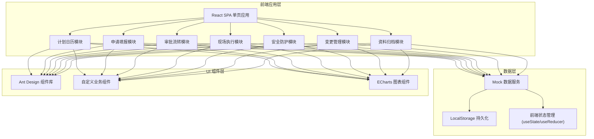
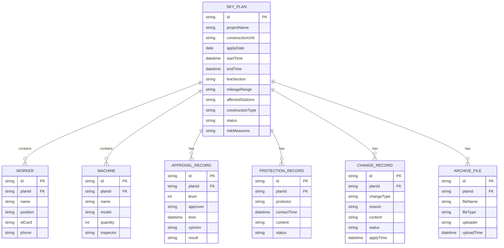

## 1. 架构设计



## 2. 技术选型说明

- **前端框架**：React@18 + TypeScript，提供类型安全和组件化开发
- **构建工具**：Vite@5，快速热更新和构建
- **UI 组件库**：Ant Design@5，企业级组件，适配中后台系统
- **路由**：React Router@6，单页应用路由管理
- **图表库**：ECharts@5，兑现率统计等数据可视化
- **样式方案**：TailwindCSS@3 + Ant Design 主题定制
- **日期处理**：dayjs，轻量级日期处理库
- **数据方案**：前端 Mock 数据 + LocalStorage 持久化，无需后端服务

## 3. 路由定义

| 路由路径 | 页面名称 | 功能说明 |
|----------|----------|----------|
| / | 计划日历 | 系统首页，天窗时段日历视图 |
| /application | 申请填报 | 施工天窗申请表单填报 |
| /approval | 审批流转 | 多级审批流程处理 |
| /execution | 现场执行 | 封锁命令确认、签到销记 |
| /safety | 安全防护 | 防护员联络记录、措施检查 |
| /change | 变更管理 | 计划变更、延期申请 |
| /archive | 资料归档 | 资料上传、统计报表 |

## 4. 数据模型定义

### 4.1 数据模型 ER 图



### 4.2 天窗计划状态枚举

```typescript
type SkyPlanStatus = 
  | 'draft'      // 草稿
  | 'pending'    // 待审批
  | 'approved1'  // 一级审批通过
  | 'rejected'   // 已驳回
  | 'approved'   // 审批通过
  | 'commanded'  // 命令已下达
  | 'signin'     // 已签到开工
  | 'executing'  // 执行中
  | 'signout'    // 已销记
  | 'completed'  // 已完成
  | 'archived';  // 已归档
```

## 5. 核心数据结构 TypeScript 定义

```typescript
// 天窗计划
interface SkyPlan {
  id: string;
  projectName: string;
  constructionUnit: string;
  personInCharge: string;
  phone: string;
  applyDate: string;
  startTime: string;
  endTime: string;
  lineSection: string;
  mileageStart: string;
  mileageEnd: string;
  affectedStations: string[];
  constructionType: string;
  workers: Worker[];
  machines: Machine[];
  riskMeasures: string;
  status: SkyPlanStatus;
  currentApprovalLevel: number;
  createdAt: string;
  updatedAt: string;
}

// 作业人员
interface Worker {
  id: string;
  name: string;
  position: string;
  idCard: string;
  phone: string;
}

// 施工机具
interface Machine {
  id: string;
  name: string;
  model: string;
  quantity: number;
  inspector: string;
}

// 审批记录
interface ApprovalRecord {
  id: string;
  planId: string;
  level: number;
  levelName: string;
  approver: string;
  approvalTime: string;
  opinion: string;
  result: 'approved' | 'rejected' | 'pending';
}

// 防护记录
interface ProtectionRecord {
  id: string;
  planId: string;
  protector: string;
  contactTime: string;
  content: string;
  isAbnormal: boolean;
  abnormalDesc?: string;
}

// 变更记录
interface ChangeRecord {
  id: string;
  planId: string;
  changeType: 'time' | 'scope' | 'delay' | 'cancel';
  changeTypeName: string;
  reason: string;
  oldContent: string;
  newContent: string;
  status: 'pending' | 'approved' | 'rejected';
  applyTime: string;
}
```
